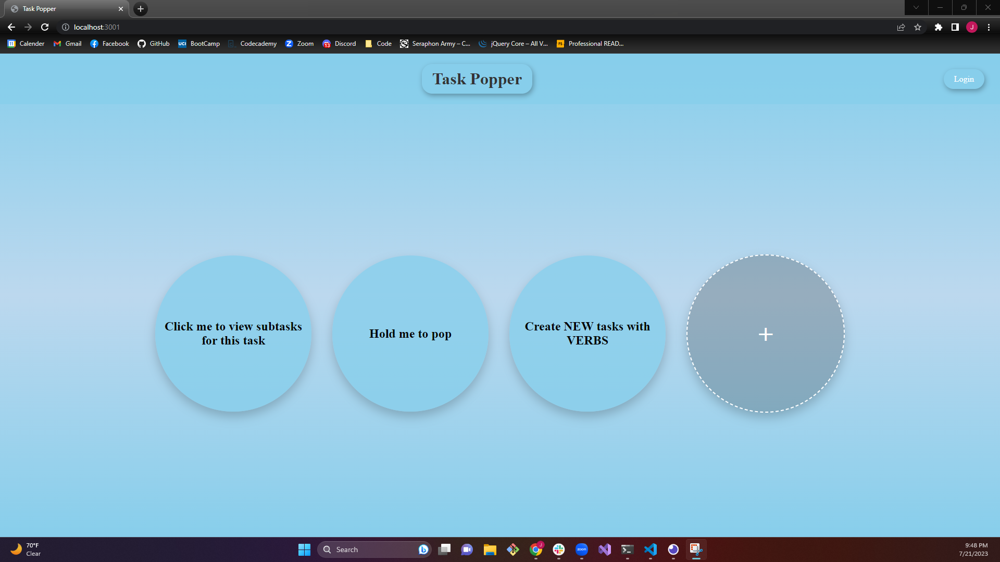
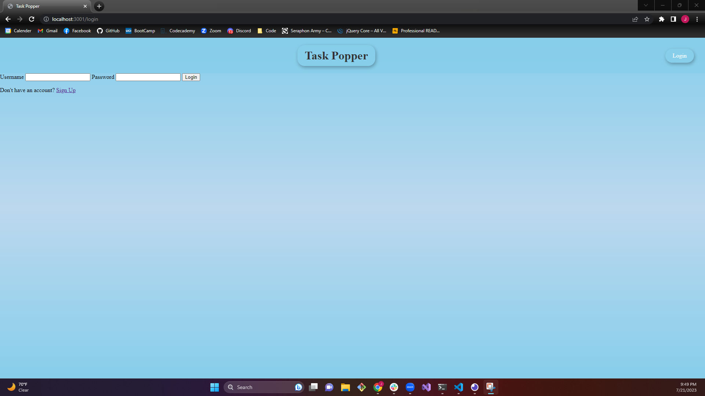
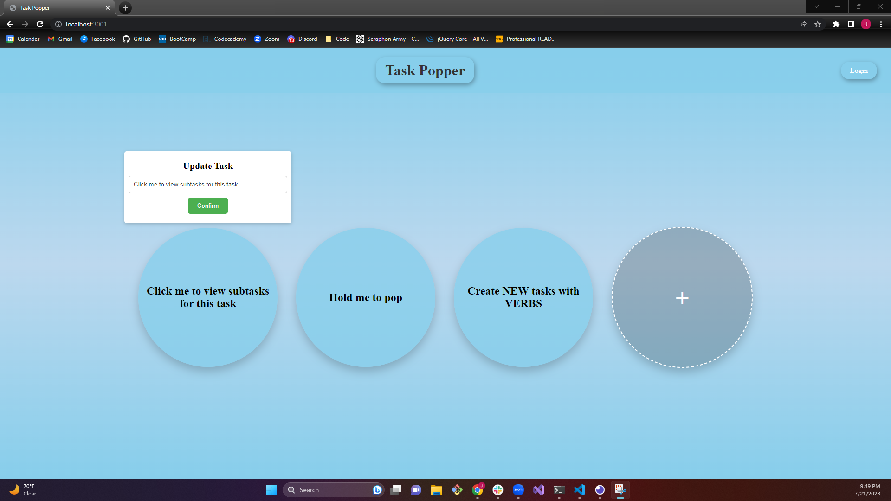

# Task Popper

## Description

Task popper is a streamlined and simplified approach to task management. The user will only be shown their tasks as bubbles. There are only 3 current options. Create bubble (task), edit bubble, and pop bubble (complete tasks)

The idea came from looking at other options that are available and are fantastic for companies and individuals who enjoy seeing a ton of information but might not be great for parents, or kids, or even just someone with anxiety who can be easily overwhelmed

User Story: As a user I want an app to help me track my tasks i need to accomplish in an easy and minimalistic way that I wont feel overwhelmed when loading it.

## Usage

Usage of the app is very simple. The User is prevented with a very limited but intuitive design so when they reach the homepage they will be presented with their previous tasks if they are already logged in or pre-generated ones if not.

At the top right they can login which will also give them the option to create an account.

The tasks or bubbles themselves have a couple options, when clicked they will be presented with the option to edit the text, and when held the bubbles will shake and then "pop" deleting the task.

The user can click on the + button circle to create an entirely new task if they desire.

## Credits

Created by: 
Dustin Bonilla: https://github.com/19dbo91
Joel Quezada: https://github.com/SirDrPancake
Jake Norris: https://github.com/Searaden

## Other Links
Live: 
Github Repo: https://github.com/Searaden/Task-Popper
Pitch: https://docs.google.com/presentation/d/1i1kod8kaOXrFI5FsuI1t5q0vLrG1t00wkSUDEmT2Ji4/edit#slide=id.p
WireFrame: https://www.figma.com/file/B3oRHV984h00eQ1sNYFwcf/Untitled?type=design&node-id=0-1&mode=design&t=u0XAp9a7NKRu7Hkw-0
